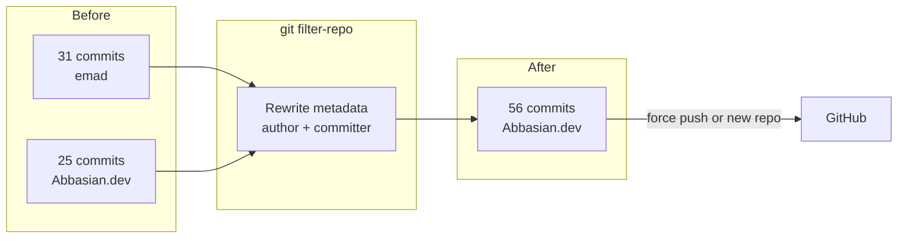

# Rewrite Git Blame: emad → Abbasian.dev

## Current state

| Metric | Value |
|--------|-------|
| Total commits | 56 |
| `emad <razavioo@gmail.com>` | 31 (author **and** committer on all 31) |
| `Abbasian.dev <mam-1371@outlook.com>` | 25 |
| Branches | `main` only |
| Tags | `v1.0.0-alpha` (tagger already Abbasian.dev) |
| Remote | [https://github.com/abbasiandev/raybod.git](https://github.com/abbasiandev/raybod.git) |

## What “no changes / no new commits” means here

Git blame reads **commit metadata** (author name/email), not file content. The only way to change blame attribution is to **rewrite existing commits in place**:

- **File tree at HEAD stays identical** — no source code, config, or doc changes
- **No extra commit is appended** on top of `main`
- **Commit SHAs will change** for all 31 affected commits (and any commits after them). This is unavoidable; blame cannot change without rewriting history.

After rewrite, `git log`, `git blame`, and GitHub’s blame UI will show `Abbasian.dev` everywhere `emad` appeared before.

**Note:** [`android/test_output.txt`](android/test_output.txt) is tracked and contains `/Users/emad/...` paths in its **content**. That is unrelated to git blame authorship and will not be touched unless you separately ask to remove that file.

## Recommended tool: `git filter-repo`

`git filter-repo` is the modern, safe replacement for `filter-branch`. It is not installed on your machine yet; install once via Homebrew:

```bash
brew install git-filter-repo
```

## Step-by-step procedure

### 1. Backup (mandatory)

Create a full mirror backup before touching history:

```bash
cd /Users/mahdiabbesian/Documents/Android/Workspace/raybod
git clone --mirror . ../raybod-backup.git
```

If anything goes wrong, restore from this mirror.

### 2. Rewrite author + committer metadata

Run from the repo root. This rewrites **both** author and committer fields (required — all 31 `emad` commits have matching committer):

```bash
git filter-repo --force --commit-callback '
if commit.author_name == b"emad":
    commit.author_name = b"Abbasian.dev"
    commit.author_email = b"mam-1371@outlook.com"
if commit.committer_name == b"emad":
    commit.committer_name = b"Abbasian.dev"
    commit.committer_email = b"mam-1371@outlook.com"
'
```

`--force` is needed because filter-repo refuses to run on repos with a remote unless forced (we re-add the remote afterward).

**Alternative (built-in, no install):** `git filter-branch` with an `--env-filter` — works but is slower and leaves backup refs under `refs/original/`. Prefer filter-repo.

### 3. Re-add remote

`git filter-repo` removes remotes by design. Reconnect:

```bash
git remote add origin https://github.com/abbasiandev/raybod.git
```

### 4. Verify locally (before pushing)

```bash
# Should show only Abbasian.dev (56 commits total)
git shortlog -sne --all

# Spot-check a formerly-emad commit
git log --format='%an <%ae> | %cn <%ce>' | sort -u

# Confirm zero file diffs vs backup HEAD (same tree)
git diff raybod-backup.git:refs/heads/main HEAD

# Confirm blame shows Abbasian.dev (pick any file touched by emad)
git blame readme.md | head -20
```

Expected: **zero** occurrences of `emad` in author/committer fields; file content unchanged.

### 5. Publish to GitHub

You offered two equivalent paths — pick one:

**Option A — Force-push (simpler, keeps repo URL/settings)**

```bash
git push --force --tags origin main
```

**Option B — Delete and recreate repo (clean slate)**

1. Delete `abbasiandev/raybod` on GitHub (Settings → Danger zone)
2. Create a new empty repo with the same name
3. Push:

```bash
git push -u origin main
git push origin --tags
```

Both options replace GitHub history entirely. Option B avoids any stale cached refs on GitHub’s side.

### 6. Cleanup local backup refs (filter-branch only)

If you used `filter-branch` instead, remove leftover refs:

```bash
git for-each-ref --format='delete %(refname)' refs/original | git update-ref --stdin
git reflog expire --expire=now --all && git gc --prune=now --aggressive
```

`git filter-repo` does this automatically.

## Architecture of the rewrite



## Side effects to expect

- **All commit SHAs change** for rewritten commits; open PRs, CI run links, and external references to old SHAs break
- **Collaborators** must re-clone or hard-reset — `git pull` will fail
- **GitHub contribution graph** may shift if emails don’t match your GitHub account; ensure `mam-1371@outlook.com` is verified on your GitHub profile
- **Tag `v1.0.0-alpha`** will point to a new commit SHA (same content, new hash) — force-push tags with `--tags`

## Rollback

If verification fails before push:

```bash
cd ..
rm -rf raybod
git clone raybod-backup.git raybod
```

If already pushed, restore from backup mirror and force-push again.
