# 🦅 Project Sentinel: Strategic & Architectural Blueprint

> **Version**: 1.2.0 | **Last Updated**: 2025-12-19 | **Status**: All Phases Complete (excluding Enterprise)

This document serves as the single source of truth for the **Raybod** project. It outlines the strategic mandate, system architecture, and the phased implementation roadmap to deliver a next-generation mobile threat defense platform.

---

## 1.0 Strategic Mandate & Market Opportunity

### 1.1 The Evolving Mobile Threat Landscape
Mobile devices are the new perimeter. The convergence of personal and professional data on a single device makes them high-value targets.
*   **85%** of organizations reported increased mobile attacks (Verizon MSI).
*   **4M+** mobile-focused social engineering attacks in 2024.
*   **BYOD** expands the attack surface significantly.

**Primary Attack Vectors:**
1.  **Phishing/Smishing**: Leading threat (48% in Retail, 39% in Healthcare).
2.  **Vulnerable Applications**: Unpatched apps as entry points.
3.  **Surveillanceware**: Stealthy data exfiltration (e.g., BnkRat, KrSpy).
4.  **Sideloaded Apps**: Bypassing store vetting mechanisms.

### 1.2 The Solution: Raybod
Our response is **"Practical AI"**:
*   **On-Device**: Instant, offline, battery-efficient protection using TFLite.
*   **Cloud**: Deep analysis and global threat intelligence.

**Architectural Pillars:**
| Pillar | Justification |
| :--- | :--- |
| **Platform Focus** | Android first for deep API integration and broad market reach. |
| **Core Intelligence** | Lightweight **TFLite** model to minimize battery drain (a top user complaint). |
| **Feature Engineering** | "DNA" analysis of `AndroidManifest.xml` (Permissions + Intents) vs signatures. |
| **Software Architecture** | **Hybrid Model**: Offline autonomy + Cloud collective intelligence. |

---

## 2.0 System Architecture Blueprint

### 2.1 Architecture Overview

```mermaid
flowchart TB
    subgraph Android["📱 Android App"]
        direction TB
        UI["🎨 Presentation<br/>ScanScreen, ThreatDetails"]
        Domain["🧠 Domain<br/>ScanAppUseCase"]
        Data["💾 Data<br/>ThreatRepositoryImpl"]
        Agent["🛡️ Agent<br/>SentinelService"]
        
        subgraph ML["🤖 ML Engine"]
            FE["FeatureExtractor"]
            TF["TFLite Model"]
        end
    end
    
    subgraph Cloud["☁️ Cloud Backend"]
        API["FastAPI"]
        HE["HeuristicEngine"]
        AL["Global Allowlist"]
    end
    
    UI --> Domain --> Data
    Agent --> Data
    Data --> ML
    Data <--> API
    API --> HE --> AL
    
    style Android fill:#1a1a2e,stroke:#00ff87,stroke-width:2px
    style Cloud fill:#1a1a2e,stroke:#ff006e,stroke-width:2px
    style ML fill:#16213e,stroke:#00d4ff,stroke-width:2px
```

### 2.2 On-Device Agent: The "Sentinel Brain"
Autonomous, real-time threat detection.
*   **Feature Extractor**: Static analysis of `AndroidManifest.xml` & bytecode. Generates a binary feature vector (DNA) based on risky permissions/intents (inspired by Drebin).
*   **Inference Engine**: Optimized **TensorFlow Lite** model (`saved_model.tflite`). Input: Feature Vector -> Output: Risk Score (0.0 - 1.0).
*   **Verdict System**: Maps Risk Score to **Safe**, **Risky**, or **Malware**.

### 2.3 Cloud Infrastructure: The Global Intelligence Hub
Python FastAPI backend acting as a force multiplier.
*   **Crowdsourced Intelligence**: Aggregates anonymized threat metadata.
*   **False Positive Mitigation**: "Global Allowlist" API to verify risky verdicts.
*   **OTA Model Updates**: Secure delivery of new `.tflite` models.

---

## 3.0 Implementation Roadmap

### Phase 0-2: Foundational Layers & Core AI Engine ✅
Established the technical bedrock and on-device detection.
- [x] **Project & Backend Setup**: Android multi-module + Python FastAPI skeleton.
- [x] **Test Infrastructure**: Comprehensive coverage for Domain, Data, and Presentation layers.
- [x] **On-Device AI Integration**: `saved_model.tflite` integration, "DNA" Feature Extractor with Explainability, and TFLite Service.

### Phase 3: Real-Time Protection ✅
Transforming from on-demand to always-on.
- [x] **Develop SentinelService**: Foreground service listening for `PACKAGE_ADDED`.
- [x] **Implement Instant Alerting**: Notifications for "Scanning..." and "Threat Detected!".
- [x] **Optimize Performance**: Enforce < 500ms execution budget via efficient signature hashing and resource parsing.

### Phase 4: UI/UX & Threat Visualization ✅
Building trust through transparency and aesthetics.
- [x] **Radar Dashboard**: Visualize the scanning process (Scanning -> Feature Extraction -> Verdict).
- [x] **Threat Details View**: Explainability - Show **WHY** an app was flagged (e.g., "Requests SMS + Camera").
- [x] **Cyberpunk Polish**: Apply "Hacker/Cyberpunk" design system (Neon colors, dark mode, glitch effects).

### Phase 5: Cloud Connector & Hybrid Intelligence ✅
Activating the hybrid network effects.
- [x] **Enable Metadata Upload**: Send anonymized threat signatures to the cloud.
- [x] **Integrate Global Allowlist API**: Check "Risky" verdicts against the cloud allowlist.
- [x] **Advanced Forensic Logging**: Capture and sync source-level ensemble scores to the Cloud Brain.
- [x] **Trust-First Onboarding**: Premium UX flow for permission education and "Encouragement Loop" dashboards.

---

### Phase 6: OTA Model Updates ✅
Enabling continuous improvement of detection capabilities.
- [x] **Implement Model Versioning**: Track `.tflite` model versions on-device.
- [x] **Secure Model Delivery**: Signed model downloads with integrity verification.
- [x] **Background Model Sync**: Periodic checks for updated models via WorkManager.
- [x] **Automated Retraining**: Scripted pipeline for updating models based on new threat data.

### Phase 7: Analytics Dashboard ✅
Providing actionable intelligence to users and administrators.

### Phase 8: Network Monitoring & Packet Analysis ✅
Real-time traffic inspection and threat detection.
- [x] **SentinelVpnService**: VPN-based packet capture and flow tracking.
- [x] **Packet Parser**: SNI and DNS extraction for encrypted and plain traffic.
- [x] **NetworkHeuristicEngine**: Cloud-based entropy analysis for DGA detection.
- [x] **Network Shield UI**: Live traffic dashboard and threat log.
- [x] **Admin Dashboard**: FastAPI + Jinja2 + HTMX with role-based access control.
- [x] **Threat Trends Visualization**: Historical scan data and trend charts.
- [x] **Device Fleet Overview**: Aggregate statistics from scan logs.
- [x] **Export & Reporting**: CSV export for compliance requirements.

### Phase 8: Enterprise Features (Planned)
Scaling to organizational deployments.
- [ ] **MDM Integration**: Support for major MDM platforms (Intune, Jamf, etc.).
- [ ] **Policy Engine**: Configurable scan policies and response actions.
- [ ] **Compliance Reporting**: SOC2, GDPR, and HIPAA audit trails.

### Phase 9: Commercialization & Plans ✅
Implementing the business model with a sandbox payment system.
- [x] **Subscription Backend**: Plans, Subscriptions, and Payment models.
- [x] **Sandbox Gateway**: Debuggable payment page (Success/Fail).
- [x] **Web Landing Page**: High-conversion "Real Security" homepage + Pricing.
- [x] **Android Feature Gating**: Lock Premium features (Forensics, Real-time).

---

## 4.0 Technical Debt & Known Limitations

> [!NOTE]
> Tracking known limitations ensures transparency and guides future improvements.

| Item | Impact | Priority | Status |
| :--- | :--- | :--- | :--- |
| Backend allowlist is hardcoded | Limited scalability | Medium | **RESOLVED** (Available in DB) |
| No rate limiting on `/api/v1/scan/analyze` | Potential DoS vulnerability | High | **RESOLVED** (10/min limit) |
| Model retraining pipeline not automated | Manual ML updates | Medium | **RESOLVED** (Automated pipeline implemented) |
| No offline queue for failed cloud requests | Data loss on network failure | Low | **RESOLVED** (WorkManager + SyncStatus) |
| API Security | Open endpoints | High | **RESOLVED** (API Keys and Auth implemented) |

---

## 5.0 Project Metrics

| Metric | Value |
| :--- | :--- |
| **Android Test Classes** | 20+ |
| **Backend Test Files** | 15+ |
| **Android Modules** | 6 (app, agent, core, data, domain, presentation) |
| **API Endpoints** | 25+ |
| **TFLite Model Size** | ~500KB |
| **Code Coverage** | > 85% |

---

## 6.0 Definition of Done & Success Criteria

| Criterion | Metric | Strategic Justification |
| :--- | :--- | :--- |
| **AI-Powered** | Detection driven solely by `.tflite` output (mocked in tests). | Validates the core "Practical AI" value proposition. |
| **Responsive** | UI never blocks. Background scan < 500ms. | Mitigates battery drain constraints and ensures retention. |
| **Accurate** | Correctly flags test virus (EICAR) as Malware. | Proves effective end-to-end detection. |
| **Beautiful** | Adheres to "Cyberpunk/Hacker" aesthetic. | Key differentiator; builds brand identity. |
